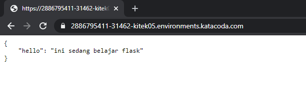

```
Your Interactive Learning Environment Bash Terminal

start.sh
$
$ start.sh
Starting Kubernetes...minikube version: v1.6.2
commit: 54f28ac5d3a815d1196cd5d57d707439ee4bb392
* minikube v1.6.2 on Ubuntu 18.04
* Selecting 'none' driver from user configuration (alternates: [])
* Running on localhost (CPUs=2, Memory=2461MB, Disk=47990MB) ...
* OS release is Ubuntu 18.04.3 LTS
* Preparing Kubernetes v1.17.0 on Docker '18.09.7' ...
  - kubelet.resolv-conf=/run/systemd/resolve/resolv.conf


* Pulling images ...
* Launching Kubernetes ...
* Configuring local host environment ...
* Done! kubectl is now configured to use "minikube"
* dashboard was successfully enabled
Kubernetes Started
$
$
$ kubectl create deployment najib-flask --image=najibun/nflask:v1
deployment.apps/najib-flask created
$ kubectl get deployments
NAME          READY   UP-TO-DATE   AVAILABLE   AGE
najib-flask   0/1     1            0           23s
$ kubectl get pods
NAME                           READY   STATUS              RESTARTS   AGE
najib-flask-86bc877644-k79lz   0/1     ContainerCreating   0          53s
$ kubectl get deployments
NAME          READY   UP-TO-DATE   AVAILABLE   AGE
najib-flask   0/1     1            0           106s
$ kubectl get pods
NAME                           READY   STATUS              RESTARTS   AGE
najib-flask-86bc877644-k79lz   0/1     ContainerCreating   0          111s
$ kubectl get pods
NAME                           READY   STATUS              RESTARTS   AGE
najib-flask-86bc877644-k79lz   0/1     ContainerCreating   0          3m3s
$ kubectl get deployments
NAME          READY   UP-TO-DATE   AVAILABLE   AGE
najib-flask   0/1     1            0           3m22s
$
$ kubectl get pods
NAME                           READY   STATUS             RESTARTS   AGE
najib-flask-86bc877644-k79lz   0/1     ImagePullBackOff   0          4m47s
$ kubectl get deployments
NAME          READY   UP-TO-DATE   AVAILABLE   AGE
najib-flask   0/1     1            0           5m11s
$ ^C
$ ls -la
total 56
drwx------ 12 root root 4096 Jan  7 14:20 .
drwxr-xr-x 25 root root 4096 Dec 17 13:44 ..
-rw-r--r--  1 root root 3295 Dec 22 16:41 .bashrc
drwx------  2 root root 4096 Jan  7 14:01 .cache
drwxr-xr-x  8 root root 4096 Oct 23 10:16 .config
drwxr-xr-x  2 root root 4096 Dec 17 13:53 Desktop
drwxr-xr-x  2 root root 4096 Dec 22 16:38 .docker
drwx------  3 root root 4096 Jan  7 14:01 .gnupg
-rw-r--r--  1 root root    0 Dec 17 13:45 .hushlogin
drwxr-xr-x  4 root root 4096 Jan  7 14:32 .kube
drwxr-xr-x 10 root root 4096 Jan  7 14:29 .minikube
-rw-r--r--  1 root root  148 Aug 17  2015 .profile
drwxr-xr-x  2 root root 4096 Dec 17 13:43 .ssh
drwxr-xr-x  2 root root 4096 Dec 22 16:38 .vnc
drwxr-xr-x 11 root root 4096 Oct 23 10:13 .vscode
$ ls
Desktop
$ mkdir najib-flask
$ cd najib-flask/
$ vim app.py
$ nano app.py
$ nano requirements.txt
$ nano app.py
$ nano Dockerfile
$ docker build -t najibun/najib-flask:v1
"docker build" requires exactly 1 argument.
See 'docker build --help'.

Usage:  docker build [OPTIONS] PATH | URL | -

Build an image from a Dockerfile
$ docker build -t najibun/najib-flask:v1 .
Sending build context to Docker daemon  4.096kB
Step 1/6 : FROM python:2.7
2.7: Pulling from library/python
8f0fdd3eaac0: Pull complete
d918eaefd9de: Pull complete
43bf3e3107f5: Pull complete
27622921edb2: Pull complete
dcfa0aa1ae2c: Pull complete
ef6ca6913068: Pull complete
a755ea00feee: Pull complete
74b6f9ff9fd6: Pull complete
bebb4b693476: Pull complete
Digest: sha256:9517f5314968111658d229ed3038630a174e7a4f1b852bd185b70f614dffba08
Status: Downloaded newer image for python:2.7
 ---> 426ba9523d99
Step 2/6 : COPY . /app


 ---> ea68a91965a8
Step 3/6 : WORKDIR /app
 ---> Running in 6118dfb39520
Removing intermediate container 6118dfb39520
 ---> 6314972fb461
Step 4/6 : RUN pip install -r requirements.txt
 ---> Running in 8db465d9d731
DEPRECATION: Python 2.7 will reach the end of its life on January 1st, 2020. Please upgrade your Python as Python 2.7 won't be maintained after that date. A future version of pip will drop support for Python 2.7. More details about Python 2 support in pip, can be found at https://pip.pypa.io/en/latest/development/release-process/#python-2-support
Collecting flask
  Downloading https://files.pythonhosted.org/packages/9b/93/628509b8d5dc749656a9641f4caf13540e2cdec85276964ff8f43bbb1d3b/Flask-1.1.1-py2.py3-none-any.whl (94kB)
Collecting flask_restful
  Downloading https://files.pythonhosted.org/packages/17/44/6e490150ee443ca81d5f88b61bb4bbb133d44d75b0b716ebe92489508da4/Flask_RESTful-0.3.7-py2.py3-none-any.whl
Collecting itsdangerous>=0.24
  Downloading https://files.pythonhosted.org/packages/76/ae/44b03b253d6fade317f32c24d100b3b35c2239807046a4c953c7b89fa49e/itsdangerous-1.1.0-py2.py3-none-any.whl
Collecting Jinja2>=2.10.1
  Downloading https://files.pythonhosted.org/packages/65/e0/eb35e762802015cab1ccee04e8a277b03f1d8e53da3ec3106882ec42558b/Jinja2-2.10.3-py2.py3-none-any.whl (125kB)
Collecting click>=5.1
  Downloading https://files.pythonhosted.org/packages/fa/37/45185cb5abbc30d7257104c434fe0b07e5a195a6847506c074527aa599ec/Click-7.0-py2.py3-none-any.whl (81kB)
Collecting Werkzeug>=0.15
  Downloading https://files.pythonhosted.org/packages/ce/42/3aeda98f96e85fd26180534d36570e4d18108d62ae36f87694b476b83d6f/Werkzeug-0.16.0-py2.py3-none-any.whl (327kB)
Collecting aniso8601>=0.82
  Downloading https://files.pythonhosted.org/packages/eb/e4/787e104b58eadc1a710738d4e418d7e599e4e778e52cb8e5d5ef6ddd5833/aniso8601-8.0.0-py2.py3-none-any.whl (43kB)
Collecting pytz
  Downloading https://files.pythonhosted.org/packages/e7/f9/f0b53f88060247251bf481fa6ea62cd0d25bf1b11a87888e53ce5b7c8ad2/pytz-2019.3-py2.py3-none-any.whl (509kB)
Collecting six>=1.3.0
  Downloading https://files.pythonhosted.org/packages/65/26/32b8464df2a97e6dd1b656ed26b2c194606c16fe163c695a992b36c11cdf/six-1.13.0-py2.py3-none-any.whl
Collecting MarkupSafe>=0.23
  Downloading https://files.pythonhosted.org/packages/fb/40/f3adb7cf24a8012813c5edb20329eb22d5d8e2a0ecf73d21d6b85865da11/MarkupSafe-1.1.1-cp27-cp27mu-manylinux1_x86_64.whl
Installing collected packages: itsdangerous, MarkupSafe, Jinja2, click, Werkzeug, flask, aniso8601, pytz, six, flask-restful
Successfully installed Jinja2-2.10.3 MarkupSafe-1.1.1 Werkzeug-0.16.0 aniso8601-8.0.0 click-7.0 flask-1.1.1 flask-restful-0.3.7 itsdangerous-1.1.0 pytz-2019.3 six-1.13.0
Removing intermediate container 8db465d9d731
 ---> 93b67b2daf09
Step 5/6 : ENTRYPOINT ["python"]
 ---> Running in f279d8eef417
Removing intermediate container f279d8eef417
 ---> 23ebb1cfd318
Step 6/6 : CMD ["app.py"]
 ---> Running in c3b93bdb476b
Removing intermediate container c3b93bdb476b
 ---> 4d1dd1b457ca
Successfully built 4d1dd1b457ca
Successfully tagged najibun/najib-flask:v1
$
$
$
$
$
$ docker login
Login with your Docker ID to push and pull images from Docker Hub. If you don't have a Docker ID, head over to https://hub.docker.com to create one.
Username: najibun
Password:
Error response from daemon: Get https://registry-1.docker.io/v2/: unauthorized: incorrect username or password
$ docker login
Login with your Docker ID to push and pull images from Docker Hub. If you don't have a Docker ID, head over to https://hub.docker.com to create one.
Username: najibun
Password:
WARNING! Your password will be stored unencrypted in /root/.docker/config.json.
Configure a credential helper to remove this warning. See
https://docs.docker.com/engine/reference/commandline/login/#credentials-store

Login Succeeded
$ docker push najibun/najib-flask:v1
The push refers to repository [docker.io/najibun/najib-flask]
613bb191a9b4: Preparing
f8ad675fd41c: Preparing
613bb191a9b4: Pushed
03a3dc679282: Mounted from najibun/nflask
35fc403d4c4c: Mounted from najibun/nflask
c1fbc35a2660: Mounted from najibun/nflask
f63773c65620: Mounted from najibun/nflask
e6d60910d056: Mounted from najibun/nflask
b52c1c103fae: Mounted from najibun/nflask
6f1c84e6ec59: Pushing [==================================================>]  17.11MB
6f1c84e6ec59: Pushed
dd5242c2dc8a: Pushed
v1: digest: sha256:400802a6961982452ecdef3d4cf2f59f00fa12064ff563d5c042f64e467bfab6 size: 2639
$
$ kubectl create deployment python-flask --image=najibun/najib-flask:v1
deployment.apps/python-flask created
$ kubectl get deployments
NAME           READY   UP-TO-DATE   AVAILABLE   AGE
najib-flask    0/1     1            0           31m
python-flask   0/1     1            0           10s
$ kubectl get deployments
NAME           READY   UP-TO-DATE   AVAILABLE   AGE
najib-flask    0/1     1            0           31m
python-flask   0/1     1            0           51s
$ kubectl get pods
NAME                           READY   STATUS             RESTARTS   AGE
najib-flask-86bc877644-k79lz   0/1     CrashLoopBackOff   6          32m
python-flask-695494c48-ln7zd   0/1     Pending            0          114s
$ kubectl get pods
NAME                           READY   STATUS             RESTARTS   AGE
najib-flask-86bc877644-k79lz   0/1     CrashLoopBackOff   7          36m
python-flask-695494c48-ln7zd   1/1     Running            0          5m24s
$ kubectl get deployments
NAME           READY   UP-TO-DATE   AVAILABLE   AGE
najib-flask    0/1     1            0           36m
python-flask   1/1     1            1           5m52s
$ kubectl get events
LAST SEEN   TYPE      REASON                    OBJECT                              MESSAGE
38m         Normal    Starting                  node/minikube                       Starting kubelet.
38m         Normal    NodeHasSufficientMemory   node/minikube                       Node minikube status is now: NodeHasSufficientMemory
38m         Normal    NodeHasNoDiskPressure     node/minikube                       Node minikube status is now: NodeHasNoDiskPressure
38m         Normal    NodeHasSufficientPID      node/minikube                       Node minikube status is now: NodeHasSufficientPID
38m         Normal    NodeNotReady              node/minikube                       Node minikube status is now: NodeNotReady
38m         Normal    NodeAllocatableEnforced   node/minikube                       Updated Node Allocatable limit across pods
38m         Normal    NodeReady                 node/minikube                       Node minikube status is now: NodeReady
37m         Normal    RegisteredNode            node/minikube                       Node minikube event: Registered Node minikube in Controller
37m         Normal    Starting                  node/minikube                       Starting kube-proxy.
28m         Normal    RegisteredNode            node/minikube                       Node minikube event: Registered Node minikube in Controller
19m         Normal    RegisteredNode            node/minikube                       Node minikube event: Registered Node minikube in Controller
17m         Normal    RegisteredNode            node/minikube                       Node minikube event: Registered Node minikube in Controller
14m         Normal    RegisteredNode            node/minikube                       Node minikube event: Registered Node minikube in Controller
8m23s       Normal    RegisteredNode            node/minikube                       Node minikube event: Registered Node minikube in Controller
37m         Normal    Scheduled                 pod/najib-flask-86bc877644-k79lz    Successfully assigned default/najib-flask-86bc877644-k79lz to minikube
18m         Normal    Pulling                   pod/najib-flask-86bc877644-k79lz    Pulling image "najibun/nflask:v1"
18m         Warning   Failed                    pod/najib-flask-86bc877644-k79lz    Failed to pull image "najibun/nflask:v1": rpc error: code = Unknown desc = context canceled
18m         Warning   Failed                    pod/najib-flask-86bc877644-k79lz    Error: ErrImagePull
18m         Normal    BackOff                   pod/najib-flask-86bc877644-k79lz    Back-off pulling image "najibun/nflask:v1"
18m         Warning   Failed                    pod/najib-flask-86bc877644-k79lz    Error: ImagePullBackOff
16m         Normal    Pulled                    pod/najib-flask-86bc877644-k79lz    Successfully pulled image "najibun/nflask:v1"
15m         Normal    Created                   pod/najib-flask-86bc877644-k79lz    Created container nflask
15m         Normal    Started                   pod/najib-flask-86bc877644-k79lz    Started container nflask
15m         Normal    Pulled                    pod/najib-flask-86bc877644-k79lz    Container image "najibun/nflask:v1" already present on machine
111s        Warning   BackOff                   pod/najib-flask-86bc877644-k79lz    Back-off restarting failed container
37m         Normal    SuccessfulCreate          replicaset/najib-flask-86bc877644   Created pod: najib-flask-86bc877644-k79lz
37m         Normal    ScalingReplicaSet         deployment/najib-flask              Scaled up replica set najib-flask-86bc877644 to 1
<unknown>   Normal    Scheduled                 pod/python-flask-695494c48-ln7zd    Successfully assigned default/python-flask-695494c48-ln7zd to minikube
3m31s       Normal    Pulled                    pod/python-flask-695494c48-ln7zd    Container image "najibun/najib-flask:v1" already present on machine
3m30s       Normal    Created                   pod/python-flask-695494c48-ln7zd    Created container najib-flask
3m29s       Normal    Started                   pod/python-flask-695494c48-ln7zd    Started container najib-flask
6m6s        Normal    SuccessfulCreate          replicaset/python-flask-695494c48   Created pod: python-flask-695494c48-ln7zd
6m7s        Normal    ScalingReplicaSet         deployment/python-flask             Scaled up replica set python-flask-695494c48 to 1
$ kubectl config view
apiVersion: v1
clusters:
- cluster:
    certificate-authority: /root/.minikube/ca.crt
    server: https://172.17.0.147:8443
  name: minikube
contexts:
- context:
    cluster: minikube
    user: minikube
  name: minikube
current-context: minikube
kind: Config
preferences: {}
users:
- name: minikube
  user:
    client-certificate: /root/.minikube/client.crt
    client-key: /root/.minikube/client.key
$ kubectl expose deployment python-flask --type=LoadBalancer --port=5000
service/python-flask exposed
$ kubectl get services
NAME           TYPE           CLUSTER-IP     EXTERNAL-IP   PORT(S)          AGE
kubernetes     ClusterIP      10.96.0.1      <none>        443/TCP          39m
python-flask   LoadBalancer   10.96.35.208   <pending>     5000:31462/TCP   13s
$
```

